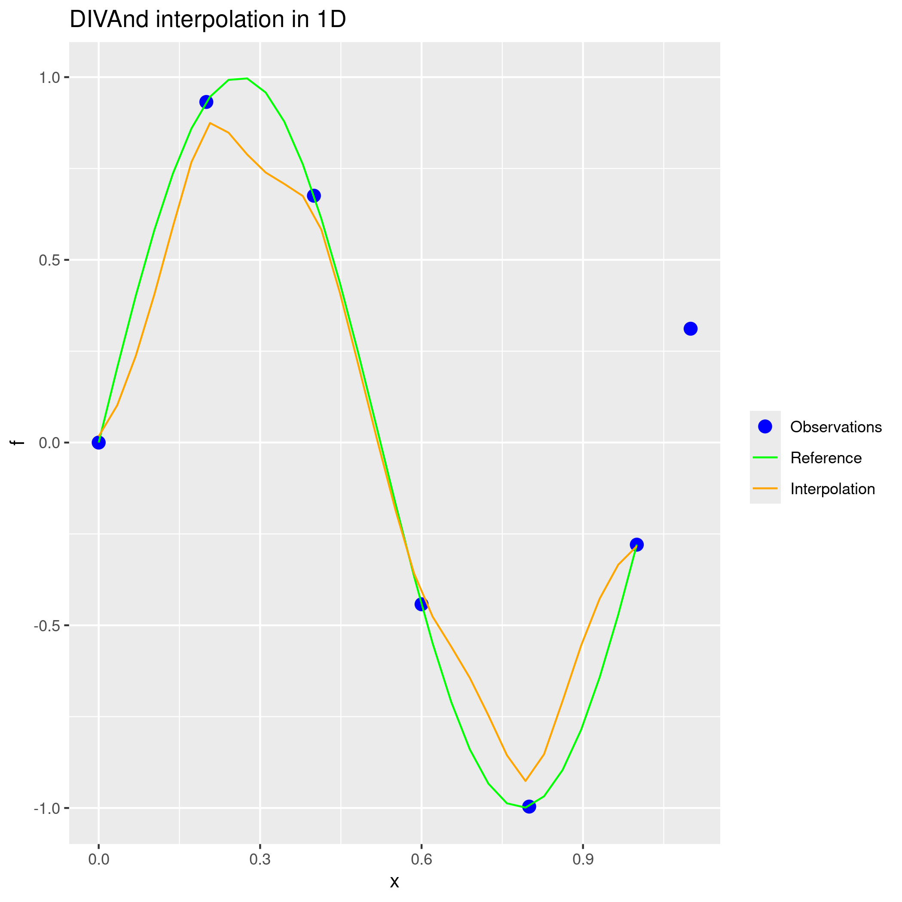

# Installation and configuration 

The instructions are given for a machine running under Ubuntu (22.04.3 LTS -- Jammy).      
For Windows, the instructions are similar but may requires adaptations for the commands.

## Installation of R

__Documentation:__ https://cran.r-project.org/web/packages/JuliaCall/readme/README.html

```bash
sudo apt install r-base
```

To ensure that the installation has been successful, type `R` in a terminal:
```bash
$ R

R version 4.5.0 (2025-04-11) -- "How About a Twenty-Six"
Copyright (C) 2025 The R Foundation for Statistical Computing
Platform: x86_64-pc-linux-gnu

R is free software and comes with ABSOLUTELY NO WARRANTY.
You are welcome to redistribute it under certain conditions.
Type 'license()' or 'licence()' for distribution details.

  Natural language support but running in an English locale

R is a collaborative project with many contributors.
Type 'contributors()' for more information and
'citation()' on how to cite R or R packages in publications.

Type 'demo()' for some demos, 'help()' for on-line help, or
'help.start()' for an HTML browser interface to help.
Type 'q()' to quit R.
```

### Editor [optional]

If you want to work with an editor, the most widely used is [Rstudio](https://posit.co/download/rstudio-desktop/). Visual Studio Code also comes with various extensions to work with R (REditorSupport, R Debugger, ...). 

It can be installed via the terminal
```bash
sudo apt install rstudio
```

## Installation of Julia

We suggest to use the `juliaup` tool (https://github.com/JuliaLang/juliaup), which makes easier the installation, upgrade and management of different versions of Julia. On Linux or Mac:

```bash
curl -fsSL https://install.julialang.org | sh
```

The Julia version that will be used can be obtained with the command:

```bash
juliaup status
```

which gives, in our case:

```bash
 Default  Channel  Version                 Update 
--------------------------------------------------
          1.10.4   1.10.4+0.x64.linux.gnu         
          1.10.9   1.10.9+0.x64.linux.gnu         
          1.11.4   1.11.4+0.x64.linux.gnu         
       *  rc       1.11.5+0.x64.linux.gnu         
          release  1.11.5+0.x64.linux.gnu 
```

## Installation of Julia language in R

The selected library to call Julia in R is [`JuliaCall`](https://github.com/JuliaInterop/JuliaCall).

In a R session:

```R
install.packages("JuliaCall")
```

You are asked if you want to use a personal library (type "yes"):

```R
Warning in install.packages("JuliaCall") :
  'lib = "/usr/local/lib/R/site-library"' is not writable
Would you like to use a personal library instead? (yes/No/cancel) 
```

### Tested R versions

* _Eye Holes_
```R                         
version.string R version 4.3.2 (2023-10-31)
nickname       Eye Holes
```
* _Bird Hippie_
```R
version.string R version 4.1.2 (2021-11-01)
nickname       Bird Hippie    
```
* _Shortstop Beagle _
```R
version.string R version 4.2.3 (2023-03-15)
nickname       Shortstop Beagle  
```
* _How About a Twenty-Six_
```R
version.string R version 4.5.0 (2025-04-11)
nickname       How About a Twenty-Six
```   

## Installation of netCDF 

`R` relies on the utility `nc-config` (a command to query netCDF build options). It can be installed by running the command:

```bash
sudo apt-get install libnetcdf-dev
```

then the library can be installed:

```R
install.packages("ncdf4")
```

## Installation of other packages [optional]

No used so far but let's keep it here for the time being.

### jsonlite
When tested with Visual Studio Code, the editor required to install `jsonlite`

```R
install.packages("jsonlite")
```

even if the installation may not be a strict requirement.

### logger 
The `logger` package is also installed for the logging purposes.

```R
install.packages("logger")
```

### Plotting libraries

In Julia, the plots are created with the [`Makie`](https://makie.org/website/) and [`GeoMakie`](https://geo.makie.org/v0.7.12/) modules.           
It might be more relevant to use only `R` library for the plotting tasks:

```R
install.packages("ggplot2")
install.packages("ggmap")
install.packages("sf")
install.packages("terra")
install.packages("rnaturalearth")
install.packages("rnaturalearthdata")
```

| Library  | Description |
| ------------- | ------------- |
| [ggplot2](https://cran.r-project.org/web/packages/ggplot2/index.html)  | creating graphics, based on _The Grammar of Graphics_  |
| [ggmap](https://cran.r-project.org/web/packages/ggmap/index.html)  | spatial data and models on top of static maps |
| [rnaturalearth](https://cran.r-project.org/web/packages/rnaturalearth/index.html)  | World Map Data from Natural Earth |
| [rnaturalearthdata](https://cran.r-project.org/web/packages/rnaturalearthdata/index.html) | World Map Data from Natural Earth Used in 'rnaturalearth' |
| [sf](https://cran.r-project.org/web/packages/sf/index.html)  | simple features, to encode spatial vector data  |
| [terra](https://cran.r-project.org/web/packages/terra/index.html)  | spatial data analysis with vector and raster data |
  

## Configure Julia

You may want to specify the path to the Julia executable with the command `julia_setup`:

```R
library(JuliaCall)
julia_setup(JULIA_HOME = path.expand("~/.juliaup/bin/"))
```

If successful, this command will give:

```R
Julia version 1.11.5 at location /home/ctroupin/.julia/juliaup/julia-1.11.5+0.x64.linux.gnu/bin will be used.
Loading setup script for JuliaCall...
Finish loading setup script for JuliaCall.
```

so you can test if R is actually going to use the correct Julia executable.      

### Installing Julia packages

We use the command `julia_install_package_if_needed( )` for the installation.      
(some errors happened with using `julia_install_package( )`).

__Documentation:__ https://search.r-project.org/CRAN/refmans/JuliaCall/html/julia_package.html

```R
julia_install_package_if_needed("Statistics")
julia_install_package_if_needed("DIVAnd")
julia_install_package_if_needed("NCDatasets")
```

### Loading Julia packages

Before running the `julia_command(" ")`, 
ensure that the Julia packages are already installed (with the Julia version specified in the variable `JULIA_HOME`).

```R
julia_command("using Statistics")
```

__Note:__ it is also possible to start a Julia session within `R`:

```R
system("julia")
```

### NCDatasets

It may be necessary to issue this command __before__ starting the `R` session, in order to ensure the correct `libcurl` is used:

```bash
export LD_PRELOAD=${HOME}/.julia/juliaup/julia-1.10.0+0.x64.linux.gnu/lib/julia/libcurl.so.4.8.0
```

(with the obvious adaptations in the path and in the library number).    
The previous command ensures that the file will be loaded before any other library.

```R
julia_command("using NCDatasets")
julia_command("using DIVAnd")
```

If the commands worked, the outputs are:

```R
Precompiling NCDatasets
  2 dependencies successfully precompiled in 5 seconds. 44 already precompiled.
```

and

```R
Precompiling DIVAnd
  1 dependency successfully precompiled in 4 seconds. 192 already precompiled.
```

## Quick test

This simple test can be run in a terminal:

```bash
Rscript DIVAnd_simple_1D.R
```

which will output

```R
Julia version 1.11.5 at location /home/ctroupin/.julia/juliaup/julia-1.11.5+0.x64.linux.gnu/bin will be used.
Loading setup script for JuliaCall...
Finish loading setup script for JuliaCall.
Saving 7 x 7 in image
Julia exit.
```

The results will be written in the netCDF file `diva_1D.nc` (in the product/netcdf directoryà and the following figure will be produced:


